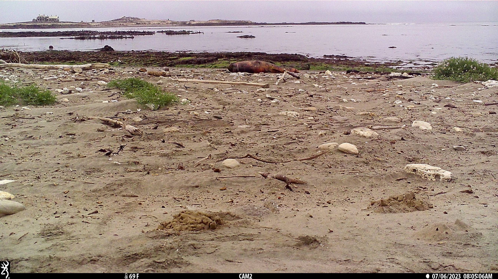

# Metadata Extractor for Browning Timelapse+ Files

*Gerraty, FD (fgerraty\@ucsc.edu; frankiegerraty\@gmail.com)*

------------------------------------------------------------------------

Camera traps are an incredibly useful research tool, and several camera trap models have timelapse features that can be used for a variety of research purposes (for example, when you are taking photos of wildlife beyond the effective detection distance of your camera model). However, several data management and processing issues can arise when camera settings are not optimized for research purposes.

Several Browning cameras have a feature called "Timelapse+" which takes photos at set increments during daytime hours and also takes photos via standard infrared detection during both day and night. However, the daytime photos (both timelapse photos and infrared-triggered photos) are compressed and combined into a .AVI video file. All of the image exif metadata from individual photos are lost in this process, and need to be manually extracted from each image. In addition, because timelapse and infrared-triggered photos are combined into one file, they need to be identified and separated if you plan to analyze the photos separately.

This repository includes solutions to the aforementioned problems I encountered in processing data from Browning's "Timelapse+" feature, which may be of use for various purposes. Hope it will be of help to others!

------------------------------------------------------------------------

# Problem 1: Photo Decompression

Browning's Timelapse+ mode stores videos as a .TLS file, which is actually just an AVI video file. To make these videos viewable on your computer, change the filename suffix from ".TLS" to ".avi". The file should then be viewable by most media players (e.g. VLC media player). Each frame in these videos is a timelapse or infrared-triggered image taken from sunrise-sunset, and each day has its own AVI video file. Infrared-triggered photos taken during nighttime are stored as photos in a separate folder on the SD card.

For most purposes, we would like to extract each image from these videos and have independent photo files (e.g, .png or .jpeg) for each frame. There are several ways to extract the photos from each frame:

1)  Use the tool developed by Saul Greenberg that uses ffmpeg to extract image files, as described here: <https://saul.cpsc.ucalgary.ca/timelapse/pmwiki.php?n=Main.ExtractingTLSFiles>

2)  Extract photos using a media player such as Adobe Premiere Pro (How-to video: <https://www.youtube.com/watch?v=r1nWR8t43gY>) or VLC Media Player (Not recommended because of how the image capture works. How to here: <https://averagelinuxuser.com/video-to-images-with-vlc-media-player/>)

3)  There are likely other methods and I will add them here when I find good ones.

Unfortunately, video files do not store the same metadata as photos do and, as a result, all of the important metadata from the camera trap photos are lost through this compression/extraction process (cue *Problem 2*).

------------------------------------------------------------------------

# Problem 2: Metadata Capture from Images

In many cases, metadata (date, time, etc.) can be extracted from camera trap images via exif metadata files. There are a variety of excellent tools that allow for you to extract exif data from individual photo files such as CamTrapR (<https://github.com/jniedballa/camtrapR>). However, in some cases (including when working with Browning Timelapse+ files), this exif metadata is lost and we need to retrieve metadata from the images themselves. Fortunately, most camera trap images contain key metadata within the image, which we can extract using optical character recognition using the *tessaract* package (<https://github.com/tesseract-ocr/tesseract>).

For this guide, we will use data from one of my research projects examining marine mammal carrion scavenging assemblages along the California coast. Here is an example of a single frame extracted from one the the Browning Timelapse+ video files. Our goal is to extract the photo's date and time from the bottom right corner of the black panel at the bottom of the image.

